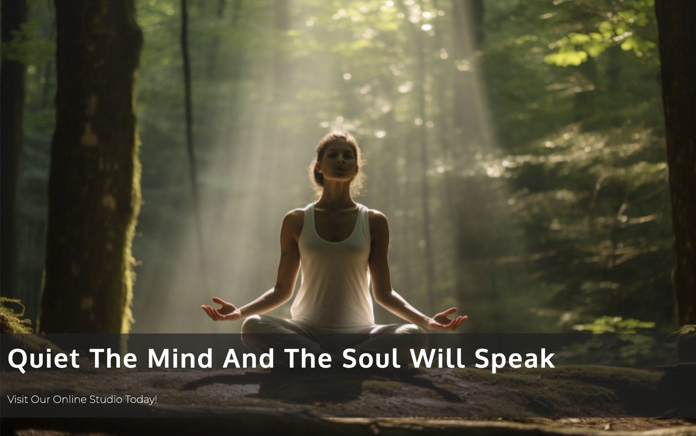
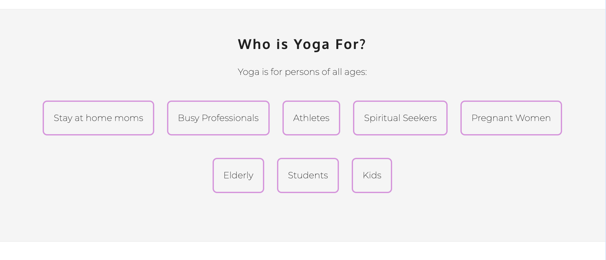

# YogaWithMe

## Introduction
YogaWithMe is an introductory Site for Yoga beginners. It is
designed for persons interested in learning about Yoga and who want to 
start the practice while experiencing the endless benefits 
of Yoga. The user is exposed to numerous materials to 
help get them started on their journey. Practice sessions are all 
conveniently one click away, with a team of instructors to
help along the way.

# Planning Stage

## Target Audience:

- Users interested in learning more about Yoga and its benefits
- Users who want to experience oneness with the universe through different breathing techniques
- Users that are open-minded and willing to try new things
- Users interested in losing weight
- Users beginning a spiritual journey
 

## User Stories:

- As a user, I want to be able to find information about Yoga
- As a user, I want to navigate easily through the pages of the site 
- As a user, I want to be able to reach out to the team if I need more information
- As a user, I want simple breakdowns on how to get started learning Yoga
- As a user, I want easy examples and tutorials to enhance my learning experience

## Site Aims:

- To make users feels welcomed when visiting the site
- To help improve the lives of the users through this practice
- To provide a convenient way to learn and practice Yoga from the comfort of your own home
- To make available an easy-to-use contact form if the user needs more information
- To learn more about us and how we got started
- To encourage everyone to try Yoga, by making it very easy to follow along
- Providing the user with a one-stop on Yoga introductory and getting started with Yoga
 

## How Will This Be Achieved 

- The Front Page has a summary on Yoga and its origin. This is also accompanied by a more detailed video. Images and a list of Yoga benefits are also available.
- The Yoga Studio provides interactive Yoga videos from an introductory video on yoga postures to our professional instructors providing walkthroughes on how to perform each exercise/technique
- The Site has a simple layout that won't overwhelm the user regardless of age
- The site is user-friendly with conventional icons and a simple display allowing anyone to navigate easily throughout the pages
- A form is provided for user interaction with the Yoga Team for more information
- The user can visit our About Us page to learn more about how YogaWithMe got started and get information about the Founder

# Common Features

---
+ The Navigation Bar 
  - The navigation bar takes a common design across all four pages in keeping with convention. The logo is placed on the upper left side of the page and the four pages (Home, studio ... etc.) are displayed to the immediate  right 
  - The navigation bar consists of the Home, Studio, About Us and Contact Us pages. (There is also a feedback form page, However this is only displayed after filling out the contact form and clicking on the submit button )
  - Links are included on all four of the page tiles including the logo. These titles link to their respective pages for easy navigation. The logo links back to the homepage as a typical shortcut users may be familiar with.
  - The navigation bar is fully responsive. For smaller screens, the hamburger icon will appear and the logo centered on the page. Once the icon is clicked a dropdown menu of all four pages will be visible to the user. A horizontal line will appear under the users current page in this view
  - For tablets, desktops and larger devices the navigation bar displays the title as stated in the second bullet above. (This was achieved using "white-space: nowrap" as a style to the media). A horizontal line appears under the current page as a visual indicator to the user indicating which page they are currently on. Titles have a change of colour and a line appearing underneath them once hovered to visually indicate to users that they are clickable.

 ## Hero-Image

This image was carefully selected as it shows a lady sitting in 
a traditional yoga pose with her eyes closed and hands open to her sides
in a forest with a halo of light shining upon her. The image gives the feeling 
that the lady is embracing nature, becoming one with all 
that's around her. For me this image represents where Yoga
can take you through practice.

- Footer
  - The footer design is consistent throughout all pages on this site
  - The footer is made up of a grey background which includes logo links to each of the social media platforms. These are equally spaced across the footer. This provides the user with a visual call to action to prompt them into visiting the organisation's social media profiles.
  - When clicked, these links will take you to the login page of the corresponding social media page.
  
  

## HomePage Features

---
The Home page welcomes the user to the site. It then gives a short summary 
of Yoga and it's origin. Below this, a video was added giving more detail 
about this.

### This introductory video dives deeper into the meaning of yoga. It gives the user a better understanding on the true nature of yoga

### With a border around each list. The site goes on to list just a few type of people that can get started with yoga.

### Three images are evenly stretched across the page with a brief encouraging note below to match each image.

### For further assurance, a list of Yoga benefits are listed to the right and an image to the left.

## The Studio Page

 - This page has a banner with the tile of the page centered. This banner is consistent with all pages expect the Home Page

 - The Studio page prepares you with a list of what you will need displayed on the left of the page with an image to its right showing basic Yoga poses.

- It also offers an explanatory video going into detail on how to perform basic Yoga poses

 - It introduces you to the three Yoga instructors. 
 - The user starts with a 10min yoga video, keeping it short and simple
   for beginners
- The user will move on to a 40min video for those who may be willing to try something a bit more challenging.
- Lastly, a stretch is provided as it is important after exercising 
- In these videos you are taught how to breath and provided with expert tips and knowledge 
- When viewed on mobile/small screens the images and videos become smaller to fit the screen size and are displayed in columns, one after the other 
- And when viewed on larger screens, the instructor videos are displayed as flex and positioned in a row as shown below:

## The About Us page

- This page layout shows the who-we-are text aligned to the left and an image to its immediate right. This layout is reversed when displaying the Our-Goal section below. A light grey background color helps differentiate between the two summaries allowing a better reading experience.

- Who-we-are summary gives the User an insight on the life of Emily Stuart the Founder of YogaWithMe and how she first fell in love with Yoga and started this company. (The name Emily Stuart was created only to add a name to this story)
- Our-Goal summary is positioned directly below the Who-we-are summary. This informs the reader of the Founder's goal and what you can expect from the practice.

## Contact Us

The contact form provides users with the ability to contact the YogaWithMe team directly with any queries or comments they may have. The user is asked to fill in their full name, email address, subject and the content of their message.

 - Hidden Pages
    - Once the contact form is correctly filled out, the feedback-page will appear thanking the customer for their feedback/message.
    - This page takes the same page structure as the contact us page, but with the feedback page content.

## Testing 

---
Testing was performed with the following devices/browsers:

- Desktop computer: (2560 x 1440) display
- Google Chrome
- Firefox
- Microsoft Edge
- MacBook Pro: 13.3-inch (2560 × 1600) display
- Google Chrome
- iPad Pro: (2732 x 2048) display 
- iOS Safari
- iPhone Xr: 828 x 1792 display
- iOS Safari

I also utilised the Chrome and Firefox developer tools to
simulate the display on other devices and test the responsiveness of the site.

## Bugs and Fixes

1. - Issue Found: 
       - I wanted to reverse the order of the text and image displayed on the our-goal section. Placing the image to the left of the page and the text to the right. 
    - Causes:
        - The computer reads the web pages from left to right. However, I needed the computer to read the text first even though it was displayed to the left and the image to the right. 
   - Solution Found:
        - After some research I found out that I could  use reverse "flex-direction: row-reverse" and this would allow the computer to see the text as being more important and read it first. 

2. - Issue Found:
      - After using the Wave tool there was an error indicated on the nav-toggle.
   - Cause:
      - There was an input that didn't have an associated label.
   - Solution Found: 
       - I added a label and styled the visibility as hidden

## Validator Testing

- HTML

No errors were returned when passing through the official W3C Validator.
  - [Home page](https://validator.w3.org/nu/?doc=https%3A%2F%2Fayishasandiford.github.io%2Fyogawithme-pp1%2Findex.html)
  - [Studio page](https://validator.w3.org/nu/?doc=https%3A%2F%2Fayishasandiford.github.io%2Fyogawithme-pp1%2Fstudio.html)
  - [About Us page](https://validator.w3.org/nu/?doc=https%3A%2F%2Fayishasandiford.github.io%2Fyogawithme-pp1%2Fabout.html)
  - [Contact Us page](https://validator.w3.org/nu/?doc=https%3A%2F%2Fayishasandiford.github.io%2Fyogawithme-pp1%2Fcontact.html)
  - [Feedback Form Page](https://validator.w3.org/nu/?doc=https%3A%2F%2Fayishasandiford.github.io%2Fyogawithme-pp1%2Ffeedback_form.html)

#### CSS

No errors were returned when passing through the official (Jigsaw) Validator [Results](https://jigsaw.w3.org/css-validator/validator?uri=https%3A%2F%2Fayishasandiford.github.io%2Fyogawithme-pp1%2Findex.html&profile=css3svg&usermedium=all&warning=1&vextwarning=&lang=en)

- Lighthouse

I generated a lighthouse report on both desktop and mobile view. The Performance low score is due to the embedded youtube videos used on my site. 
Solution - This can be resolved by adding a placeholder so that the page can load more quickly and then using javascript to dynamically add the embedded YouTube iframe to the page.

Below is the score of the lighthouse generated report of the About Us page
No videos were used on this page. This report was good. 
  

## Deployment 

- The site was deployed to GitHub pages. the steps to deploy are as follows:
   - In the GitHub repository, navigate to the settings tab
   - Select the pages link from the setting menu on the left hand side
   - Under the GitHub Pages from the source section drop-down menu, select the master branch
   - Once the master branch has been selected, the page will be automatically refreshed with a detailed ribbon display to indicate the successful deployment.
   - The live link can be found here - [YogaWithMe Live Site](https://external.ink?to=ayishasandiford.github.io/yogawithme-pp1/)

## Credits

### Honorable Mentions

  This project could not have happened without the support of the following people listed in no particular order:

- Omar Fitzpatrick - My big brother and mentor who introduced me to HTML and CSS back in 2011 giving me my first project to replicate the CNN website. Big thanks for always being there to answer a quick question, help with planning and support!!!
- David Bowers - My Mentor. I couldn't have been paired with a better Mentor! I am forever thankful for your guidance and support.
- Kyle Skeete - Provided me with design tips to help improve the look of my contact us page. Big Thanks!!
- Code Institute - For giving me this opportunity and providing me with unlimited resources, step by step videos and tons of support!
- Ilyas Olgun - Has been very helpful providing me with tips and some bug fixes
- The Code Institute Slack community where I was able to find answers to problems in CSS and HTML
- And my amazing Fiancé Steven Rawlins who has been my rock and my biggest cheer leader from day one. Thank you for your continuous support every step of the way!

## General reference:

The project was influenced by the Code Institutes code along project called Love running and [Wellspring Wellness Theme](https://wellspring.qodeinteractive.com/) . Although I have tried to deviate as much as possible there may be some similarities in the code.
I relied upon [W3schools](https://www.w3schools.com/), and stack overflow for general references throughout this project.

## Content

- Text was generated by Chat Gpt
- Title icon used was from [Font Awesome](https://fontawesome.com/) 
- Fonts were imported from [Google fonts](https://fonts.google.com/?preview.text=Code%20Insitute)

## Media

- What is Yoga video on index page - content creator Sadhguru - [Youtube](https://www.youtube.com/watch?v=XLk5yks9c_Q&t=142s)
- Introductory video on Studio Page - content creator [BRIGHT SIDE](https://www.youtube.com/watch?v=rt1bsoOukjI&t=15s)
- Yoga instructor Adriene - content creator [Yoga With Adriene](https://www.youtube.com/watch?v=j7rKKpwdXNE&t=2s)
- Yoga instructor Charlie - content creator [Charlie Follows](https://www.youtube.com/watch?v=9fp9OQZvXRM&t=514s)
- Yoga instructor Sarah Beth - content create [SarahBethYoga](https://www.youtube.com/watch?v=-ZPyCILWvT0&t=2s)
- Images from [Pexels](https://www.pexels.com): About Us page, and Benefits on yoga image
- Images from [FreePik](https://www.freepik.com/): Home Page - Hero image and three aligned images
- Images from [Pintrest](https://www.pinterest.com/): Studio Page - Beginner Pose Image
- Home Page List icons - Author Arshad - [IconsForFree](https://icons-for-free.com/)
- The embedded video HTML code was generated by [YouTube](https://www.youtube.com/)
- Quote displayed on front page banner - Buddha Quotes -[Buddha Quotes](https://declutterthemind.com/blog/buddha-quotes/)
- Images requiring compression were done using - tiny.png
- Screenshots used for README.md section was created view [Am I responsive](https://ui.dev/amiresponsive)
- Color grid contract tool - [Eightshapes]( https://contrast-grid.eightshapes.com/)
- Calculator used to resize figure images  - Adobe Photoshop

